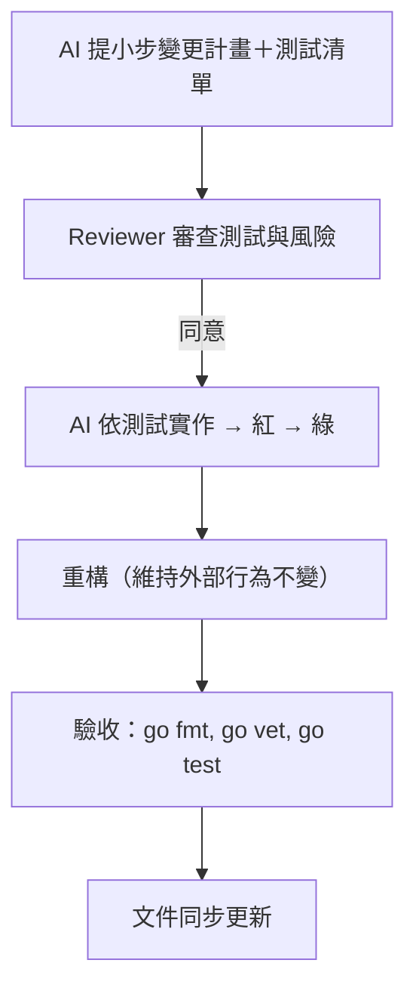

# AGENTS.md（核心規範）

## 文件定位
- **目的**：定義 AI 與 Reviewer 的角色分工與工作流程，確保專案在嚴格 TDD 下協作順暢。  
- **範圍**：本文件僅描述「角色與流程規範」，技術細節另見 [ARCHITECTURE.md](./ARCHITECTURE.md)。  
- **受眾**：AI Agent、Reviewer/Gatekeeper，以及參與專案維運者。

---

## 角色定義

### AI Agent（驅動設計與實作）
- 規劃藍圖與介面邊界。  
- 提供或更新測試與測試資料。  
- 標註風險、替代方案與回滾策略。  
- 負責實作，並維護小步迭代。

### Reviewer / Gatekeeper
- 僅審查測試與介面可行性與安全性。  
- 不直接撰寫功能碼。  
- 在測試紅燈時回饋落差，協助 AI 調整測試或介面。  

（可選擴充：PM/PO/UX 代理角色，另行增補）

---

## 工作流程（嚴格 TDD）

### 流程圖（Mermaid）

### 步驟（簡述）
1. **計畫**：AI 提小步變更計畫＋測試檔案清單。  
2. **審查**：Reviewer 確認測試覆蓋關鍵行為與風險。  
3. **實作**：AI 依測試實作，確保紅 → 綠。  
4. **重構**：僅在綠燈後，維持外部行為不變。  
5. **驗收**：跑 `go fmt`, `go vet`, `go test ./... -cover`。  
6. **文件同步**：更新 README/AGENTS/使用說明。  

---

## 規則與安全邊界
- **必須**：所有變更需先有測試。  
- **不得**：讀寫敏感檔案（如 `.env`, `secrets.*`, `*.pem` 等）。  
- **建議**：小步提交、單一主題 PR、可回滾。  

### 常見錯誤 vs 正確示例（表格化）

| 常見錯誤 | 正確做法 |
|----------|-----------|
| 一次大重構，提交難以回滾 | 拆成小步驟，每步可測、可回滾 |
| Reviewer 直接修改功能碼 | Reviewer 僅提供意見，修改由 AI 執行 |
| 缺乏測試就直接實作 | 先撰寫最小測試，再開始實作 |
| 文件不同步（程式更新但 AGENTS 未改） | 每次提交需同步更新文件，保持一致 |
| PR 涵蓋過多主題 | 保持單一主題，避免複雜合併 |

---

## 文件維護
- **版本號**：v1.0.0  
- **更新紀錄**：每次修改需加註日期與摘要。  
- **維護責任人**：專案 Owner（可在 README 指定）。

---
