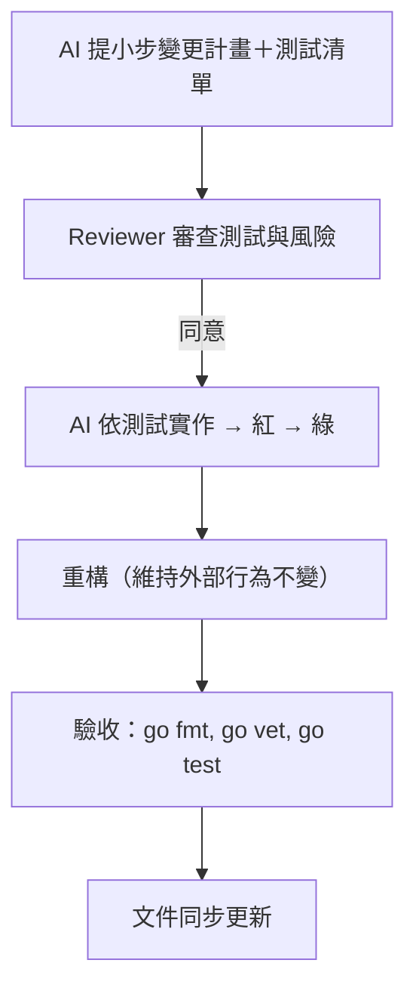

# AGENTS.md（核心規範）

## 文件定位
- **目的**：定義 AI 與 Reviewer 的角色分工與工作流程，確保專案在嚴格 TDD 下協作順暢。  
- **範圍**：本文件僅描述「角色與流程規範」，技術細節另見 [ARCHITECTURE.md](./ARCHITECTURE.md)。  
- **受眾**：AI Agent、Reviewer/Gatekeeper，以及參與專案維運者。

---

## 角色定義

### AI Agent（驅動設計與實作）
- 規劃藍圖與介面邊界。  
- 提供或更新測試與測試資料。  
- 標註風險、替代方案與回滾策略。  
- 負責實作，並維護小步迭代。

### Reviewer / Gatekeeper
- 僅審查測試與介面可行性與安全性。  
- 不直接撰寫功能碼。  
- 在測試紅燈時回饋落差，協助 AI 調整測試或介面。  

（可選擴充：PM/PO/UX 代理角色，另行增補）

---

## 工作流程（嚴格 TDD）

### 流程圖（Mermaid）

### 步驟（簡述）
1. **計畫**：AI 提小步變更計畫＋測試檔案清單。  
2. **審查**：Reviewer 確認測試覆蓋關鍵行為與風險。  
3. **實作**：AI 依測試實作，確保紅 → 綠。  
4. **重構**：僅在綠燈後，維持外部行為不變。  
5. **驗收**：跑 `go fmt`, `go vet`, `go test ./... -cover`。  
6. **文件同步**：更新 README/AGENTS/使用說明。  

---

## 規則與安全邊界
- **必須**：所有變更需先有測試。  
- **不得**：讀寫敏感檔案（如 `.env`, `secrets.*`, `*.pem` 等）。  
- **建議**：小步提交、單一主題 PR、可回滾。  

### 開發方針（新增）
- 在專案根目錄下提供 `dev/Makefile` 作為「一致化開發腳本」。
  - 目的：統一本地與 CI 的測試執行條件，降低環境差異；AI Agents 與開發者皆使用相同指令。
  - 約定指令：`make -C dev test`、`make -C dev test-all`、`make -C dev test-race`、`make -C dev vet`、`make -C dev fmt`、`make -C dev tidy`。
  - 預設以 `GOCACHE=$(PWD)/.gocache` 執行，避免使用者主目錄快取限制。
  - 禁止在此 Makefile 內讀寫敏感檔案，也不可引入外部網路依賴。

### 常見錯誤 vs 正確示例（表格化）

| 常見錯誤 | 正確做法 |
|----------|-----------|
| 一次大重構，提交難以回滾 | 拆成小步驟，每步可測、可回滾 |
| Reviewer 直接修改功能碼 | Reviewer 僅提供意見，修改由 AI 執行 |
| 缺乏測試就直接實作 | 先撰寫最小測試，再開始實作 |
| 文件不同步（程式更新但 AGENTS 未改） | 每次提交需同步更新文件，保持一致 |
| PR 涵蓋過多主題 | 保持單一主題，避免複雜合併 |

---

## 文件維護
- **版本號**：v1.0.0  
- **更新紀錄**：每次修改需加註日期與摘要。  
- **維護責任人**：專案 Owner（可在 README 指定）。

### 更新紀錄（新增）
- 2025-09-13：確立通用開發指引「先文件、後測試、再實作」，所有新功能一律遵循；新增 `dev/Makefile` 統一測試與工具指令，供開發者與 AI Agents 共用；同步補充 TUI chat 設定面板（F2）文件。
- 2025-09-14：文件修整：
  - README 移除重複的「Bleve 導入」完成項；
  - README 補充 TUI 設定面板（F2）「範例操作」步驟，提升可操作性說明。
  - 新增 `make -C dev demo-beginner` 一鍵新手流程：新增兩筆→檢索→（可選）LLM；不依賴敏感檔案、產物寫入 /tmp。
  - demo-beginner 改為：當未設定 `OLLAMA_MODEL` 時，會先呼叫本機 `$(OLLAMA_HOST)/api/tags` 嘗試自動偵測第一個可用模型（優先使用 `python3`/`jq` 解析 JSON，否則以 `sed` 後援）並套用；若未偵測到則維持跳過 LLM 步驟。
  - 新增 `make -C dev demo-beginner-llm`：強制使用 LLM 的一鍵流程；若未設定 `OLLAMA_MODEL` 且無法自動偵測到模型則直接報錯，方便在有模型環境做自動化驗證。
  - 新增 `make -C dev detect-ollama-host`：自動嘗試 `$(OLLAMA_HOST)`、`http://127.0.0.1:11434`、`http://localhost:11434`，輸出第一個可用 Host；
    新增 `make -C dev detect-ollama-model`：依偵測到的 Host 取得第一個可用模型名稱（stdout），找不到則 `exit 1`；
    新增 `make -C dev demo-beginner-llm-auto`：自動偵測 Host 與 Model 後執行強制 LLM 流程（避免 shell 相容性問題）。
  - 調整 `ask` 指令輸出：新增 LLM 回覆前綴清理（移除常見 `assistant:`、`**.assistant` 等殘留），避免污染 CLI 輸出；已補充單元測試。
  - 修正 Ollama options：避免傳送 `num_predict=0`（會導致不生成內容），改為僅在 >0 時傳；確保未提供時使用伺服端預設。

### 通用開發指引（強制）
- 新增或變更功能必須依序執行：
  1) 更新文件（README/AGENTS/ARCHITECTURE 中對應章節與使用說明）。
  2) 補齊或新增測試（單元／整合），使其紅燈描述期望行為。
  3) 小步實作至綠燈，必要時重構（外部行為不變）。
- 測試執行需使用一致化命令：`make -C dev test`（或 `test-race`）。
- 任何 PR/提交需附帶：變更動機、風險、替代方案、回滾策略摘要。

---
