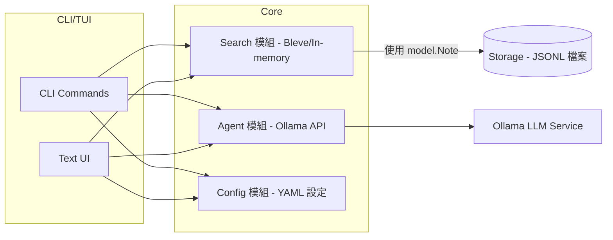

# ARCHITECTURE.md（技術附錄）

## 專案結構與模組組織
- `main.go`：CLI 初始化  
- `cmd/`：指令模組（含核心與進階）  
- `tui/`：文字介面（Bubble Tea）  
- `search/`：Bleve 搜尋索引  
- `agent/`：Ollama API 客戶端  
- `config/`：YAML 設定載入  

---

## 系統架構圖（Mermaid）

**更新說明**：Search 模組現支援 Bleve 持久化索引，保持與 in-memory 的介面相容。

---

## 介面契約（MVP 定義）
- `model.Note`（跨模組資料模型，唯一來源）  
- `storage.Storage`（檔案儲存，JSONL 格式）  
- `search.Index`（全文檢索 API）  
- `agent.LLM`（Ollama 聊天接口）  
- `config.Config`（設定載入器，支援預設值＋YAML 覆寫）  

---

## 開發與測試策略
- 強制序列：先文件、後測試、再實作（Documentation → Tests → Code）。
  - 任何新功能與介面變更，需先更新 README/AGENTS/本檔之對應段落。
  - 測試以紅→綠驅動實作，綠燈後方可重構且不得改變外部行為。
- 使用 Go `testing` 框架，採 table-driven 測試；建議在 `dev/Makefile` 下執行：
  - `make -C dev test`、`make -C dev test-race`、`make -C dev vet`、`make -C dev fmt`、`make -C dev tidy`。
- 覆蓋範圍：
  - 搜尋（索引、查詢、排序）- ✅ 包含 Bleve 與 in-memory 雙實作測試
  - CLI/TUI 互動
  - Agent 與 Ollama API（mock server）
  - Config 載入與容錯  

---

## 提交與驗收細則
- Commit：Conventional Commits 格式。  
- PR：單一主題，必要時附截圖／輸出示例。  
- DoD（Definition of Done）：
  - 測試全綠。  
  - 格式與靜態檢查無錯 (`go fmt`, `go vet`)。  
  - 文件同步更新。  

---

## 架構與流程藍圖
- CLI/TUI → 搜尋 → Prompt 注入 → Ollama → 結果顯示。  
- 路線圖（M1–M5）：文件落地 → 模組骨架 → CLI 基礎 → LLM 串接 → TUI 擴充。  

---

## 錯誤處理策略
- Ollama 不可達 → 提示檢查服務。  
- 索引缺失 → 自動建立並提示。  
- 模板缺失 → 使用內建預設並警示。  
- I/O 失敗 → 顯示具體錯誤與建議修復步驟。  

